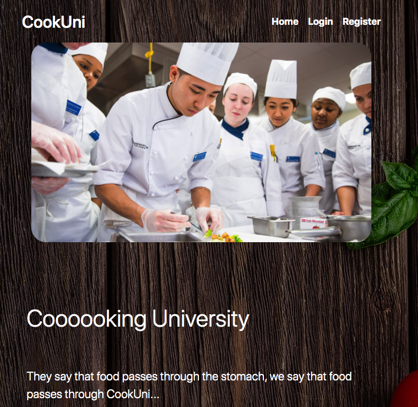

# **Cooking - Uni**
### Tasked with creating a functional recipe sharing site with DB Authorization login's and CRUD operations

    
    
     
    
    
    
    

 

### Site Preview:

    

### Instructions:

    After you download; Type "npm install"!
     

    Then type "npm run-script build"
 

    Server Start: type "npm run-script start-server"

### File Structure:
    📦cook-uni
    ┣ 📂images
    ┃ ┗ 📜homePage-background.jpg
    ┣ 📂styles
    ┃ ┗ 📜styles.css
    ┣ 📂views
    ┃ ┣ 📜details.hbs
    ┃ ┣ 📜edit.hbs
    ┃ ┣ 📜footer.hbs
    ┃ ┣ 📜header.hbs
    ┃ ┣ 📜index.hbs
    ┃ ┣ 📜login.hbs
    ┃ ┣ 📜logout.hbs
    ┃ ┣ 📜not_found.hbs
    ┃ ┣ 📜register.hbs
    ┃ ┣ 📜share.hbs
    ┃ ┗ 📜shared_recipes.hbs
    ┣ 📜.gitignore
    ┣ 📜README.md
    ┣ 📜app.js
    ┣ 📜bundle.js
    ┣ 📜index.html
    ┣ 📜package-lock.json
    ┣ 📜package.json
    ┣ 📜seed.json
    ┗ 📜webpack.config.js

## **TODO**
* [x] server - Webpack
* [x] *Kinvey setup*
* [x] *Notify Working*
* [x] Kinvey all routes working
* [x] Controllers setup 
* [x] Handlebars setup 

* **README DONE [ ]**
